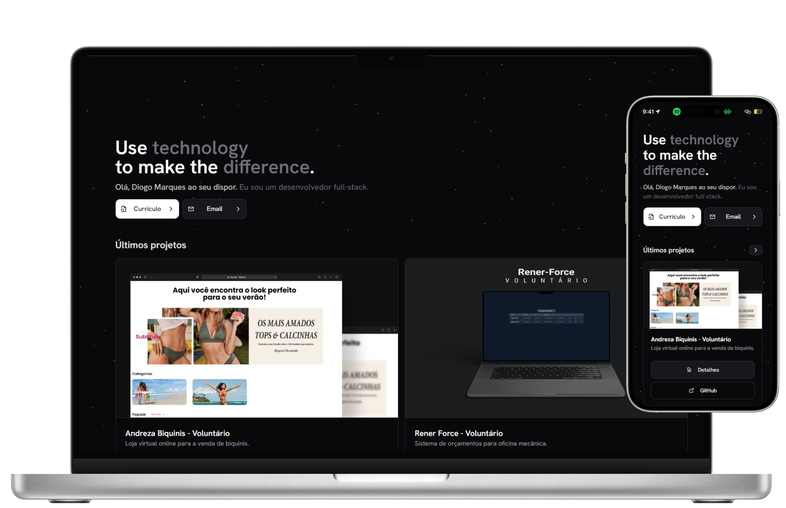

<p align="center">
   
</p>

<h1 align="center">CodeDeivid</h1>

<h3 align="center">
  🚀 Meu portfólio pessoal. 🚀
</h3>


# 💻 Tecnologias

Este projeto foi feito utilizando as seguintes tecnologias:

Front-end:
* [Tailwind CSS](https://tailwindcss.com/)
* [ReactJs](https://react.dev/)

## Como Iniciar?

### Requisitos

- [Node.js](https://nodejs.org/en/)
- [Yarn](https://classic.yarnpkg.com/) ou [npm](https://www.npmjs.com/package/npm)

**Clone o projeto e acesse a pasta**

```bash
git clone https://github.com/CodeDeivid/deividportfolio.git && cd deividportfolio
```

**Siga os passos abaixo**

```bash
# Instale as dependências na pasta raiz do projeto
$ npm install
# Inicie a aplicação
$ npm run dev
```

## 📝 Licença

Esse projeto está sob a licença MIT. Veja o arquivo [LICENSE](LICENSE.md) para mais detalhes.

---

Feito com 💜 by [Deivid Micael](https://github.com/CodeDeivid)

[](https://www.linkedin.com/in/deivid-micael-santos-silva/) 
[](mailto:deividmickael@gmail.com)
